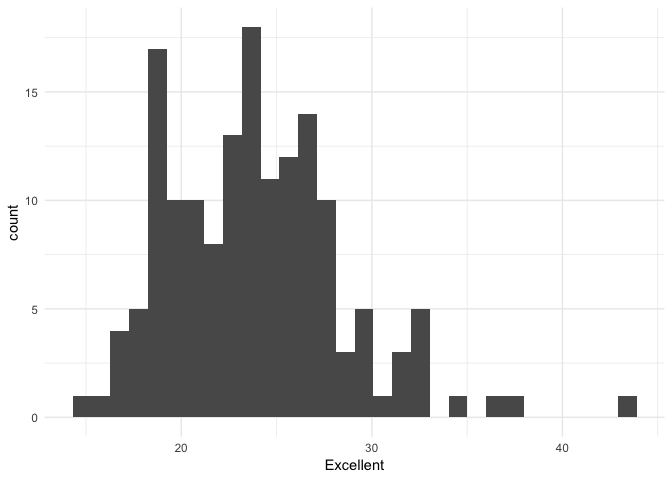
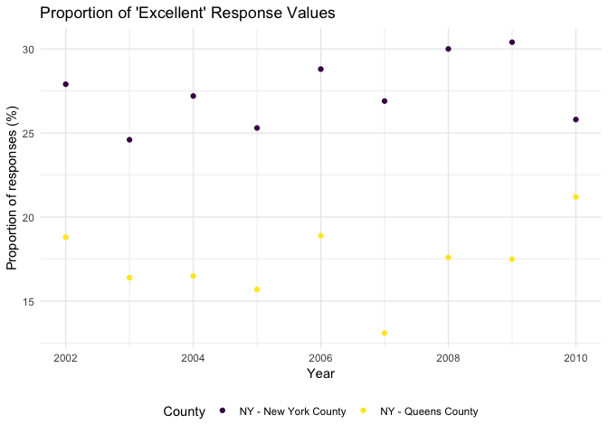

p8105\_hw2\_gsl2116
================
Grace Liu
10/05/2018

Problem 1
---------

``` r
transit_data = read_csv(file = "./HW_Data/NYC_Transit_Subway_Entrance_And_Exit_Data.csv") %>% 
  janitor::clean_names() %>% 
  select(line, station_name, station_latitude, route1:route11, entry, entrance_type, vending, ada) %>% 
  mutate(entry = recode(entry, "YES" = TRUE, "NO" = FALSE))
```

    ## Parsed with column specification:
    ## cols(
    ##   .default = col_character(),
    ##   `Station Latitude` = col_double(),
    ##   `Station Longitude` = col_double(),
    ##   Route8 = col_integer(),
    ##   Route9 = col_integer(),
    ##   Route10 = col_integer(),
    ##   Route11 = col_integer(),
    ##   ADA = col_logical(),
    ##   `Free Crossover` = col_logical(),
    ##   `Entrance Latitude` = col_double(),
    ##   `Entrance Longitude` = col_double()
    ## )

    ## See spec(...) for full column specifications.

This dataset has 1868 observations and 18 variables (dimensions = 1868 x 18). From the original 32 variables in the dataset, I have only kept 18 that are of interest in my analysis: line, station, name, station latitude / longitude, routes served, entry, vending, entrance type, and ADA compliance. This data set includes character, integer, logical, and numeric variable types.

#### How many distinct stations are there?

``` r
nrow(distinct(transit_data, line, station_name))
```

There are 465 distinct train stations.

#### How many stations are ADA compliant?

``` r
nrow(distinct(filter(transit_data, ada == TRUE), line, station_name))
```

Of these 465 distinct stations, 84 are ADA compliant.

#### What proportion of station entrances / exits without vending allow entrance?

``` r
transit_data %>%
  group_by(vending, entry) %>%
  summarise (n = n()) %>%
  mutate(freq = n / sum(n))
```

    ## # A tibble: 4 x 4
    ## # Groups:   vending [2]
    ##   vending entry     n     freq
    ##   <chr>   <lgl> <int>    <dbl>
    ## 1 NO      FALSE   114 0.623   
    ## 2 NO      TRUE     69 0.377   
    ## 3 YES     FALSE     1 0.000593
    ## 4 YES     TRUE   1684 0.999

Of station entrances/exits without vending, 37.7% allow entrance.

Problem 2
---------

``` r
mrtrash_data =
  read_excel("./HW_Data/HealthyHarborWaterWheelTotals2018-7-28.xlsx",
             sheet = "Mr. Trash Wheel", skip = 1, col_names = TRUE, range = "A2:N256") %>% 
  janitor::clean_names() %>% 
  drop_na(dumpster) %>% 
  mutate(sports_balls = as.integer(round(sports_balls)))
```

There are a total of 215 observations and 14 variables. This dataset provides data on the amount of plastic and glass bottles, cigarette butts, grocery and chip bags, polystyrene, and sports balls found in dumpsters between 2014 and 2017. The average weight (across all years) of trash within the dumpsters was 3.2764651 tons. In 2017, there was an average of 3.2591837 tons of trash in dumpsters. In 2016, the median number of sports balls in a dumpster was 26. Within this period there were 8109 total homes powered by the trash found in dumpsters. In 2017 alone, there were 2662 homes powered.

``` r
precip_2016 =
  read_excel("./HW_Data/HealthyHarborWaterWheelTotals2018-7-28.xlsx",
             sheet = "2016 Precipitation", skip = 1, col_names = TRUE, range = "A2:B14") %>% 
  janitor::clean_names() %>% 
  mutate(year = 2016)

precip_2017 =
  read_excel("./HW_Data/HealthyHarborWaterWheelTotals2018-7-28.xlsx",
             sheet = "2017 Precipitation", skip = 1, col_names = TRUE, range = "A2:B14") %>%
  janitor::clean_names() %>% 
  drop_na(total) %>% 
  mutate(year = 2017)

precip_data =
  full_join(precip_2016, precip_2017) %>% 
  mutate(month = month.name[month])
```

    ## Joining, by = c("month", "total", "year")

There are a total of 24 observations (one per month in 2016 and 2017) and 3 variables in the combined precipitation dataset. The total precipitation was 32.93 inches in 2017 and 39.95 inches in 2016. The average amount of precipitation, rounded to the nearest inch, was 3 inches in 2017 and 3 inches in 2016.

Problem 3
---------

``` r
brfss_data = brfss_smart2010 %>% 
  janitor::clean_names() %>% 
  filter(topic == "Overall Health") %>% 
  select(-class, -topic, -question, -sample_size, -confidence_limit_low:-geo_location) %>% 
  spread(key = response, value = data_value)
```

There are 404 unique locations included in the dataset. There are 51 states (plus the District of Columbia) represented. The state that is observed the most is NJ. The median of the “Excellent” response value in 2002 is 23.6.

### Graphs

#### “Excellent” response values, 2002

“Excellent” response values in the year 2002

``` r
filter(brfss_data, year == 2002) %>% 
  ggplot(aes(x = Excellent)) +
  geom_histogram() +
  theme_minimal()
```

    ## `stat_bin()` using `bins = 30`. Pick better value with `binwidth`.

    ## Warning: Removed 2 rows containing non-finite values (stat_bin).



#### Proportion of “Excellent” response values

Proportion of “Excellent” response values in New York County and Queens County (in NY State), from 2002 to 2010

``` r
ny_excellent = brfss_data %>% 
  filter(locationdesc == "NY - New York County" | locationdesc == "NY - Queens County")

ggplot(ny_excellent, aes(x = year, y = Excellent)) +
  geom_point(aes(color = locationdesc)) +
  labs(title = "Proportion of 'Excellent' Response Values",
       y = "Proportion of responses (%)",
       x = "Year") +
  viridis::scale_color_viridis(name = "County", discrete = TRUE) +
  theme_minimal() +
  theme(legend.position = "bottom")
```


